# User Manual for iFixit Knowledge Graph

**Authors**: Lewei Xu (23709058), Marc Labouchardiere (23857377)

## Table of Contents
1. [Introduction](#1-introduction)
2. [System Requirements](#2-system-requirements)
3. [Overview of the Schema](#3-overview-of-the-schema)
4. [Axioms and Ontology Rules](#4-axioms-and-ontology-rules)
5. [Example Queries](#5-example-queries)
6. [Data Management](#6-data-management)
7. [Running the Application](#7-running-the-application)
8. [Troubleshooting Guide](#8-troubleshooting-guide)

---

# 1. Introduction

### Overview of the Project

This project demonstrates the use of a small subset of data from the iFixit dataset of repair procedures. It focuses on creating a knowledge graph that enables searching, adding, updating, and deleting repair procedures using ontologies.

### Purpose of the Knowledge Graph

The iFixit Knowledge Graph is designed to represent a wide range of procedures and steps related to the repair and maintenance of various PC computers and laptops, including brands like Dell, Asus, and more. The graph organises this information in a structured format, allowing users to:
- Search and retrieve relevant procedures.
- Understand the steps involved in each repair process.

This structured approach promotes accessibility to repair knowledge, supports the **Right to Repair** movement, and enables users to efficiently find the information they need to perform repairs themselves.

### Target Audience

The target audience for the iFixit Knowledge Graph includes:
- **DIY Enthusiasts and Hobbyists**: Individuals interested in repairing their own items and learning more about the repair process.
- **Technicians and Professionals**: Those who need detailed instructions for performing work-related repairs.
- **Educators and Students**: Those seeking to understand or teach repair techniques as part of their learning or instructional activities.

## 2. System Requirements

### Software Requirements

- **Python (3.7 or higher)**: Python is the primary programming language for this project. We recommend Python version 3.7 or higher to ensure compatibility with the libraries used.

  To check your Python version, run:

  `python --version`

- **Flask**: Flask is a lightweight web framework built in Python that allows users to create simple websites. It is used to handle web requests and responses to and from the knowledge graph.

- **OWLReady2**: A Python library for ontology-based functionality, allowing for OWL ontologies. This library lets us work with semantic web technologies.

- **RDFLib**: A Python library for working with RDF (Resource Description Framework). It allows for parsing, serialising, and querying RDF data, which is essential for SPARQL queries in this project.

### Hardware Requirements (if applicable)

While there are no specific hardware requirements, the project should run efficiently on any machine that supports Python, as well as sufficient resources for running web applications. A suitable setup might include:
- **Processor**: Dual-core processor (or better)
- **Memory**: At least 4GB of RAM (or better)
- **Storage**: Sufficient memory for project files, dependencies, and the knowledge graph

### Installation Instructions for Dependencies

To set up the project environment with all the necessary dependencies, follow these steps:

1. **Activate the Virtual Environment**: A virtual environment has been provided in the project files. You can activate it using the following command:

   - On macOS/Linux:
   
     `source venv/bin/activate`
   
   - On Windows (PowerShell):
   
     `venv\Scripts\activate`

2. **Install Dependencies**: If you wish to install the dependencies locally, you can install all the required packages listed in `requirements.txt` with the following command (run in the `/project-root` directory):
   
   `pip install -r requirements.txt`

3. **Verify Installation**: To ensure that all dependencies are installed, you can check by running:
   
   `pip list`

   The installed dependencies should look similar to the screenshot below:

   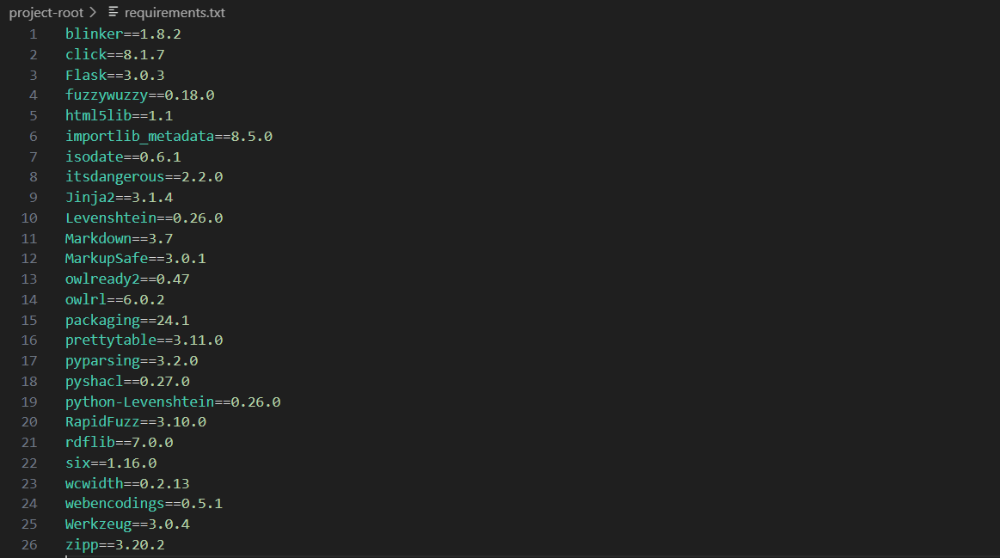
   *Requirements*

4. **Start the Application**: After installing the dependencies, ensure you can run all the project files by running:
   
   `python3 init.py -v`

## 3. Overview of the Schema

### Description of Core Concepts

The ontology schema for the iFixit dataset serves as a structured representation of knowledge, enabling the categorisation and relationship of various objects involved in procedures and repairs. This schema defines several core classes, each representing key entities crucial to the knowledge base. Below are the foundational classes and their descriptions.

The schema can be created using the Python file `/ontology/ifixit_ontology.py`, and its structure can be verified by inspecting the output OWL2 file `/ontology/ifixit_ontology.owl`.

1. **Procedure (Thing)**
   - **Definition**: The `Procedure` class represents the concept of a repair or assembly procedure. Each instance signifies a distinct sequence of steps required to complete a task.
   - **Significance**: Procedures are paramount to the iFixit dataset, guiding users through the necessary steps to repair their devices. They include relevant metadata, such as tools required, steps, images, etc.
   - **Example procedure**:  
     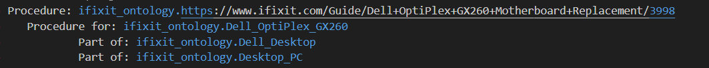
   
2. **Item (Thing)**
   - **Definition**: The `Item` class is a general category encompassing all objects within procedures, including tools and components. This class serves as a parent to more specific subclasses.
   - **Significance**: The `Item` class provides a flexible way to represent various objects in the dataset, ensuring that every object is accounted for and can be referenced in multiple contexts.
   - **Example item**:  
     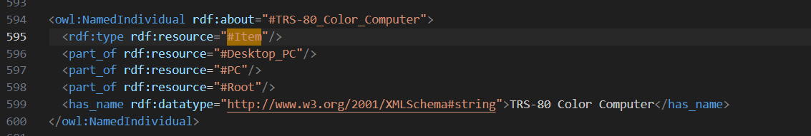
   
3. **Part (subclass of Item)**
   - **Definition**: The `Part` class is a specialised subclass of `Item`, representing individual components used in procedures. Parts are tangible elements required to complete a repair.
   - **Significance**: By defining a `Part` subclass, the ontology allows for tracking and managing specific components, enabling users to query by repair part. This enhances the functionality of the knowledge base.
   - **Example part**:  
     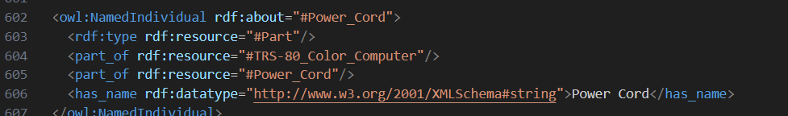

4. **Tool (Thing)**
   - **Definition**: The `Tool` class represents devices used to aid in the completion of steps or procedures. This can include hand tools, power tools, spudgers, etc.
   - **Significance**: Tools are critical for completing procedures. If repairers do not have access to the necessary tools, they may be unable to finish a repair.
   - **Example tool**:  
     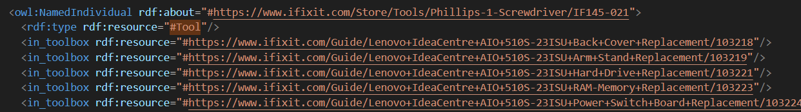

5. **Step (Thing)**
   - **Definition**: The `Step` class refers to individual actions within a `Procedure`. Each step must be completed before moving on to the next in a `Procedure`.
   - **Significance**: The `Step` class provides structure to procedures, breaking complex tasks into manageable actions, thus guiding users through the process.
   - **Example step**:  
     

6. **Image (Thing)**
   - **Definition**: The `Image` class refers to photos and visual aids provided by the procedure authors to help with completing steps. These may include diagrams, photos, or instructional graphics.
   - **Significance**: Visual aids improve the comprehension and retention of steps, allowing users to better visualise the tasks, leading to more successful outcomes.
   - **Example image**:  
     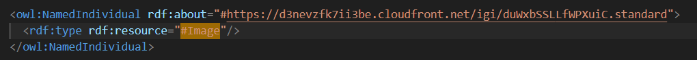

These core classes form the foundation of the knowledge base, representing all relevant objects. Next, we define the relationships between these classes and impose constraints on these relationships.

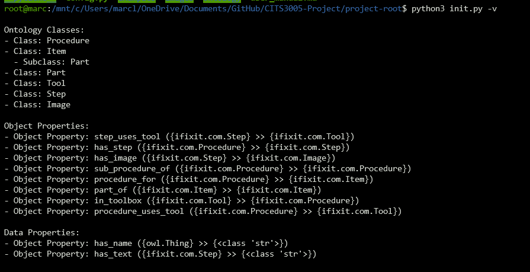

Running the command `python3 init.py -v` provides an overview of the ontology schema created.

### Key Relationships and Constraints

- **`step_uses_tool`**: `(Step -> Tool)`  
  - **Minimum relations**: 0 (A step may not necessarily use a tool)  
  - **Maximum relations**: Too many tools in a step may indicate the need to split it into smaller steps, though this is not enforced here.  
  - **Constraint**: Every tool used in a step must belong to the procedure's toolbox.  
    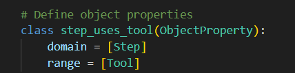

- **`has_step`**: `(Procedure -> Step)`  
  - **Minimum relations**: 1 (A procedure must have at least one step)  
  - **Maximum relations**: While too many steps could indicate poor procedure design, no upper limit is enforced.  
    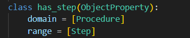

- **`has_image`**: `(Step -> Image)`  
  - **Minimum relations**: 0 (Steps may not necessarily include an image)  
    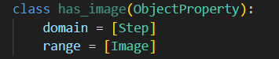

- **`sub_procedure_of`**: `(Procedure -> Procedure)`  
  - Occurs when two procedures pertain to the same item or part of an item.  
    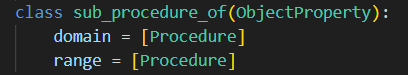

- **`procedure_for`**: `(Procedure -> Item)`  
  - **Minimum relations**: 1 (Every procedure must be associated with at least one item, or it is invalid).  
    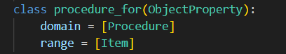

- **`part_of`**: `(Item -> Item)`  
  - **Minimum relations**: 1 (An item must be part of at least one other item).  
  - **Constraint**: This property is **transitive**. If Item 1 is part of Item 2, and Item 2 is part of Item 3, then Item 1 is also part of Item 3.  
    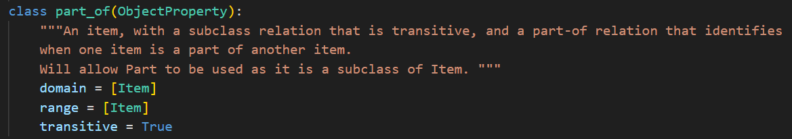

- **`in_toolbox`**: `(Tool -> Procedure)`  
  - **Minimum relations**: 1 (A tool must be included in at least one procedure's toolbox, or it is considered redundant).  
    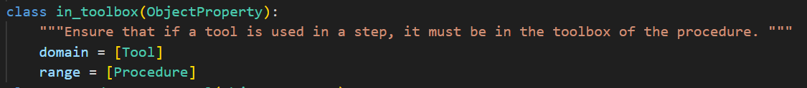

- **`procedure_uses_tool`**: `(Procedure -> Tool)` _(inverse of `in_toolbox`)_  
  - **Minimum relations**: 0 (A procedure may not need any tools).  
    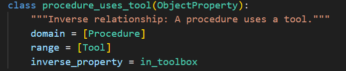

### Data Attributes for Classes

In addition to relationships, specific objects have data attributes that store relevant information:

- **`has_name`**: `(Thing -> str)`  
  - Every **procedure**, **item**, **part**, and **tool** has a `name` attribute represented as a string.  
    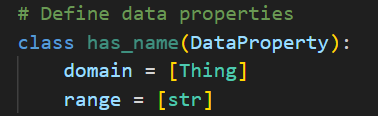

- **`has_text`**: `(Step -> str)`  
  - Each **step** has a text description of its contents.  
    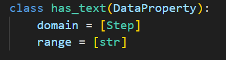

### URI Structure for Unique Instances

To ensure consistency in our knowledge graph, each class instance must use a unique URI. The following rules apply:

- **Procedure**: Use the procedure's URL as its unique URI.
- **Item**: Use the item’s name (consistent in the dataset) as its unique identifier.
- **Part**: Follow the same method as for items.
- **Tool**: Use the URL of the tool if available; if unavailable, default to its name.
- **Step**: Use the unique step ID associated with each step, allowing multiple procedures to share steps without duplicates.
- **Image**: Use the image's URL as its unique URI.

### Visual Representation of the Ontology

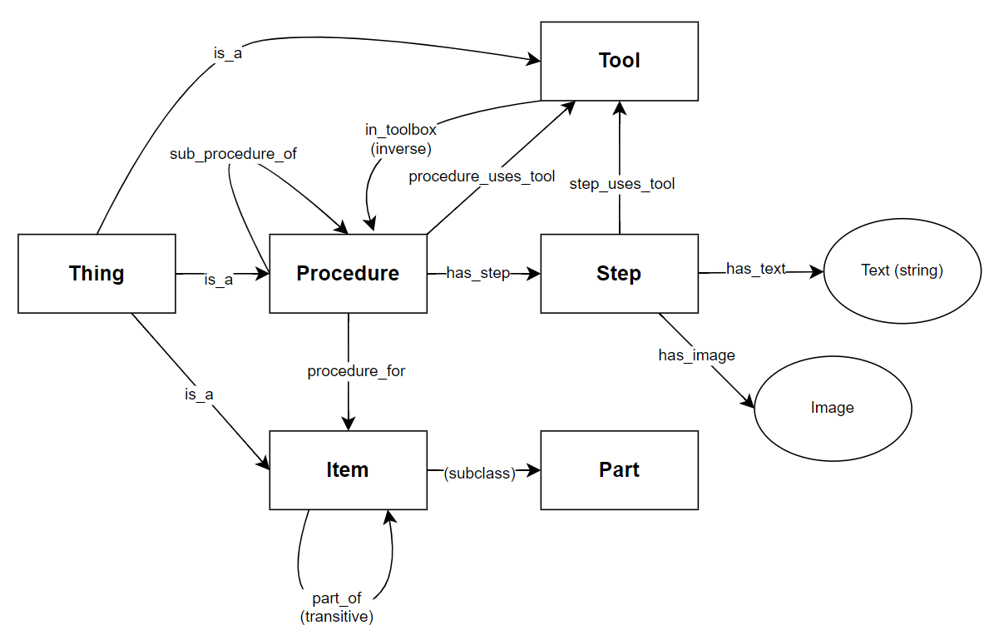

## 4. Axioms and Ontology Rules

In this section of the user manual, we explain the rules and axioms in our ontology. These rules are critical for maintaining consistency in our knowledge graph, preventing errors, and ensuring that classes and relationships can be inferred when procedure-based information is created, updated, added, or removed from the knowledge graph.

These axioms and ontology rules can be tested and verified by running the following script: `/ontology/ifixit_ontology.py`.

### Explanation of Ontology Rules

- **Transitive Subclass Relation for Items**  
  **Rule**: The `part_of` relation between `Item` and `Part` is defined as transitive. This means that if Item A is a part of Item B, and Item B is a part of Item C, then Item A is also considered a part of Item C.  
  **Purpose**: This rule allows the ontology to infer hierarchical part relationships, which is useful for nested components in larger assemblies. For example, a screw may be a part of a motherboard, which in turn is a part of a laptop. Hence, the screw is indirectly part of the laptop.  
  

- **Tools Used in Steps Must Be in the Toolbox of the Procedure**  
  **Rule**: If a `Step` within a `Procedure` uses a `Tool`, the tool must be part of the procedure's toolbox. This is enforced through an object property constraint between `Procedure` and `Tool`.  
  **Purpose**: This rule prevents tools from being used in a step unless they have been specified as available in the toolbox of the procedure.  
  

- **Sub-Procedure Relation Rules**  
  **Rule**: Sub-procedures must either share the same `Item` as the parent procedure or be related to a part of the parent procedure's item. Procedures for the same item are inferred to be sub-procedures of one another.  
  **Purpose**: This enforces a hierarchical structure. For example, a repair task for a laptop may have sub-procedures that relate to specific components of the laptop, such as the motherboard or battery. Since these sub-procedures are tied to the same item, they should be related.  
  

### SWRL Inference Rules

SWRL (Semantic Web Rule Language) inference rules are used to reason about classes and relationships in the knowledge graph.

- **Procedure Linkage Rule**  
  This inference ensures that if two procedures are linked to the same item, they are automatically inferred as sub-procedures of one another.  
  

- **Part and Item Inference Rule**  
  This rule ensures that if a procedure is both a part and an item, the `part_of` relationship between the part and the item is inferred.  
  

## 5. Example Queries

This section provides guidelines for forming SPARQL queries to retrieve information from the knowledge graph.

Some of these rules have been implemented and can be tested and verified by running `/graph/sparql_queries.py`.

### How to Form Queries

- **Identify Necessary Classes and Properties**:  
    Start by identifying the main class you want to query, as well as the properties/paths necessary to retrieve the class. For instance, if you are trying to get all steps in a procedure, the main class of interest is `Step`, and the related class is `Procedure`, which is linked to `Step` via the `has_step` property.

- **Use Data Properties**:  
    Utilise the data properties `has_text` or `has_name` to output human-readable text when running SPARQL queries.

- **Use Filters**:  
    The `FILTER` clause can be used to refine and filter results. Use it to set conditions that must be met for an instance to be included in the results. Alternatively, use the `NOT` clause before `FILTER` to do a reverse filter.

- **Aggregation Functions**:  
    For queries requiring summary statistics (e.g., counting steps in a procedure), use aggregation functions such as `COUNT` or `SUM`. Pair these with the `GROUP BY` clause to find summary statistics of groups of instances.

- **Path Traversals**:  
    With the structure of the ontology, you can utilise various paths in the knowledge graph to construct more complex queries involving multiple classes and properties. Familiarise yourself with the ontology diagram to assist in this process.

### Example 1: Retrieving All Steps for a Procedure

```sparql
PREFIX ex: <http://test.org/ifixit.com#>  
SELECT ?step_text  
WHERE {  
    ?procedure a ex:Procedure ;  
        ex:has_step ?step .  
    ?step ex:has_text ?step_text  
    FILTER (?procedure = <procedure_uri>)  
}
```
We use the procedure's URL as the URI. If the URL for a procedure is known, we can get all the steps of the procedure. In this example, we are outputting the raw text describing each step. Alternatively, you can remove the `FILTER` to output steps for every procedure.

### Example 2: Retrieving All Tools Used by a Procedure

```sparql
PREFIX ex: <http://test.org/ifixit.com#>
SELECT ?tool
WHERE {
    ?procedure a ex:Procedure .
    ?procedure ex:procedure_uses_tool ?tool .
    ?tool ex:has_name ?tool_name .
    FILTER (?procedure = <procedure_uri>)
}
```

Similarly, you can retrieve all the tools a specific procedure uses.


### Example 3: Finding Complicated Procedures

```sparql
PREFIX ex: <http://test.org/ifixit.com#>
SELECT ?procedure_name (COUNT(DISTINCT ?step) AS ?step_count) (COUNT(DISTINCT ?tool) AS ?tool_count)
WHERE {
    ?procedure a ex:Procedure ;
    ex:has_step ?step ;
    ex:has_name ?procedure_name ;
    ex:procedure_uses_tool ?tool .
}
GROUP BY ?procedure
HAVING (COUNT(DISTINCT ?step) > 20) && (COUNT(DISTINCT ?tool) > 5)
```

The previous two examples are fairly simple. You can also perform more complex aggregate or path-finding queries on the knowledge graph. The query example above identifies "complicated" procedures that have more than 20 steps and use more than 5 tools.

### More Useful Queries

These queries provide additional useful output and have been tested on the knowledge graph derived from the `/data/desktop_pcs.json` dataset. The results have been included for user examination.

#### Example 4: Get the Names of Procedures with More Than 12 Steps

```sparql
PREFIX ex: <http://test.org/ifixit.com#>
SELECT ?procedure_name (COUNT(?step) AS ?step_count)
WHERE {
    ?procedure ex:has_step ?step ;
        ex:has_name ?procedure_name .
    }
GROUP BY ?procedure
HAVING (COUNT(?step) > 12)
```

 
_Result of Example 4._

#### Example 5: Get the Names of Items with More Than 3 Procedures Written for Them

```sparql
PREFIX ex: <http://test.org/ifixit.com#>
SELECT ?item_name (COUNT(?procedure) as ?procedure_count)
WHERE {
    ?procedure ex:procedure_for ?item .
    ?item ex:has_name ?item_name .
}
GROUP BY ?item
HAVING (COUNT(?procedure) > 3)
```

 
_Result of Example 5._

#### Example 6: Find Procedures Where Tools in the Toolbox Don't Appear in Any Steps

```sparql
PREFIX ex: <http://test.org/ifixit.com#>
SELECT ?procedure_name ?tool_name
WHERE {
    # Select procedures and their associated tools from the toolbox
    ?procedure ex:has_name ?procedure_name .
    ?tool ex:has_name ?tool_name ;
        ex:in_toolbox ?procedure.
    # Ensure that the selected tool is NOT used in any step of the procedure
    FILTER NOT EXISTS {
        ?procedure ex:has_step ?step .
        ?step ex:step_uses_tool ?tool .
    }
}
```

 
_Result of Example 6._

#### Example 7: Find Potentially Dangerous Procedures, Excluding Superstring Matches (e.g., "carefully")

```sparql
PREFIX ex: <http://test.org/ifixit.com#>
SELECT ?procedure_name
WHERE {
    ?procedure ex:has_step ?step ;
        ex:has_name ?procedure_name .
    ?step ex:has_text ?text .
    FILTER (
    (REGEX(STR(?text), "careful", "i") || 
    REGEX(STR(?text), "dangerous", "i")) &&
    !(REGEX(STR(?text), "carefully", "i") || 
    REGEX(STR(?text), "dangerously", "i"))
)
}
```

  
_Part of result from Example 7._

## 6. Data Management

This section covers the processes for adding, updating, and removing data from the iFixit Knowledge Graph, as well as defining new SWRL rules for reasoning on the system.

For direct manipulation of data, use `/graph/ifixit_knowledge_graph.rdf`, and for running and testing new queries, use `/graph/sparql_queries.py`.

### Instructions for Adding Data

When adding new entries directly into the knowledge graph, ensure consistency and correctness to avoid errors. Follow these guidelines:

1. **Entity Identification**:  
   Ensure that new procedures are uniquely identifiable. Use specific names for procedures (e.g., `Procedure:ReplaceScrew` is too ambiguous).

2. **RDF Structure**:  
   All data should be entered in RDF/XML format, adhering to the current ontology schema. Entries should be structured like the following:

    ```xml
    <owl:NamedIndividual rdf:about="#https://www.ifixit.com/Guide/HP+Pavilion+Wave+600-a010+RAM-Motherboard+Replacement/99189">
      <rdf:type rdf:resource="#Procedure"/>
      <procedure_for rdf:resource="#HP_Pavilion_Wave_600-a010"/>
      <procedure_for rdf:resource="#RAM-Motherboard"/>
      <has_step rdf:resource="#182992"/>
      <has_step rdf:resource="#182993"/>
      <sub_procedure_of rdf:resource="#https://www.ifixit.com/Guide/HP+Pavilion+Wave+600-a010+RAM-Motherboard+Replacement/99189"/>
      <sub_procedure_of rdf:resource="#https://www.ifixit.com/Guide/HP+Pavilion+Wave+600-a010+hard+drive+Replacement/99186"/>
      <has_name rdf:datatype="http://www.w3.org/2001/XMLSchema#string">HP Pavilion Wave 600-a010 RAM-Motherboard Replacement</has_name>
    </owl:NamedIndividual>
    ```

3. **Properties**:  
   Use the appropriate relationships such as `procedure_for`, `has_step`, `has_name`, and `sub_procedure_of` for procedures. Other relationships may not be supported by the ontology schema.

### Updating Existing Data

To update existing records manually, this can be done via a SPARQL query or by programmatically editing entries using OWL. Follow these steps:

1. **Locate the Procedure**:  
   Use a SPARQL query or search the knowledge graph directly. For example:

    ```sparql
    PREFIX ex: <http://test.org/ifixit.com#>
    SELECT ?procedure WHERE {
      ?procedure ex:has_name "HP Pavilion Wave 600-a010 RAM-Motherboard Replacement"
    }
    ```

2. **Update the Entry**:  
   Modify the entry directly in the Knowledge Graph, or use `owlready2` to edit the entry programmatically. For example:

    ```python
    from config import KNOWLEDGE_GRAPH 
    from rdflib import Graph 
    g = Graph() 
    g.parse(KNOWLEDGE_GRAPH) 
    with g:
        proc = g.search(iri="http://test.org/ifixit.com#https://www.ifixit.com/Guide/HP+Pavilion+Wave+600-a010+RAM-Motherboard+Replacement/99189")
        proc.has_step = <step_instance>
    ```

### Removing Data

Removing an entry can be complex due to inferred relationships, but if necessary, follow this safe deletion procedure:

1. **Dependency Check**:  
   Before deleting anything, ensure that the procedure is not referenced elsewhere. Use a SPARQL query or search the Knowledge Graph:

    ```sparql
    PREFIX ex: <http://test.org/ifixit.com#>
    SELECT ?subject ?predicate WHERE {
      ?subject ?predicate <http://test.org/ifixit.com#https://www.ifixit.com/Guide/HP+Pavilion+Wave+600-a010+RAM-Motherboard+Replacement/99189>
    }
    ```

2. **Delete the Procedure**:  
   Once there are no more references, the procedure can be safely deleted. For example:

    ```python
    from config import KNOWLEDGE_GRAPH 
    from rdflib import Graph 
    g = Graph() 
    g.parse(KNOWLEDGE_GRAPH) 
    with g:
        proc = g.search(iri="http://test.org/ifixit.com#https://www.ifixit.com/Guide/HP+Pavilion+Wave+600-a010+RAM-Motherboard+Replacement/99189")
        proc.destroy()  # Delete the procedure and its relationships
    ```

### Adding Rules to the Ontology

Inference rules or logical constraints can be added to the knowledge graph to enhance its reasoning capacity. To add new rules, edit `/ontology/ifixit_ontology.py` and rebuild the knowledge graph by running `python3 init.py -v`.

1. **Define the Rule**:  
   Determine the rule you want to add that complements the existing domain of classes. For example, a rule might state that any `Procedure` related to a `Laptop` must include at least one image. This can be defined in OWL using SWRL:

    ```swrl
    Procedure(?p) ^ procedure:procedure_for(?p, ?d) ^ Device(?d) -> exists(?p, procedure:hasImage)
    ```

2. **Implement the Rule**:  
   Add the rule to `/ontology/ifixit_ontology.py` and rebuild the knowledge graph by running `python3 init.py -v`. Ensure the rule is functioning by checking the verbose output during the reasoner’s execution. Below is an example of how to add a rule using `owlready2`:

    ```python
    from owlready2 import Imp
    with ontology:
        imp = Imp()
        imp.set_as_rule("""Procedure(?p) ^ procedure:procedure_for(?p, ?d) ^ Device(?d) -> exists(?p, procedure:hasImage)""")
    ```

# 7. Running the Application

## Starting the Flask Application

The Flask application can be started by running the command `python3 -m app.app`. This will start the Flask application with the currently existing knowledge graph. Note that running the Flask application directly will require an existing knowledge graph stored in the `graph/ifixit_knowledge_graph.rdf` directory. 

If this file does not exist, you can re-initialise the knowledge graph by running the command `python3 init.py` from the project root directory. Alternatively, you can run `python3 init.py -a` which starts the app with a fresh initialisation of the knowledge graph.

Once the Flask application has started, you will see something like this:


## Accessing the Application

Once the Flask application is running, you can access it in your preferred web browser at the URL:

[http://localhost:5000/](http://localhost:5000/)

This should take you to the homepage of the iFixit Knowledge Graph interface, where you can browse and update procedures.


## User Interface Overview

The graphical user interface is designed for easy querying and updating of the underlying knowledge graph.

### Navigation

The main navigation menu is located at the top of the page, providing access to:

- **Home**: The landing page, offering an overview of the project and search options. You can reach it by clicking on "Home" or the iFixit or UWA logos.
- **Search**: A dedicated page where you can input search terms to find specific procedures related to items, tools, or parts.
- **Edit Data**: A form allowing users to submit new procedures, edit existing entries, or delete entries from the knowledge graph.
- **User Manual**: A page where you can view this user manual, rendered from markdown to HTML.

### Search Functionality

The search functionality is a core feature of the interface. It allows users to search for specific procedures by entering a query into the search bar. The system uses a fuzzy search algorithm to find relevant matches based on `Procedure:procedure_for`, `Procedure:has_name`, and keywords in the procedure name.


**Tip**: For best results when searching for a procedure, use a singular keyword. For example, if searching for "Dell OptiPlex FX170 Heat Sink Replacement", try the following queries:

- `Dell OptiPlex FX170 Heat Sink Replacement`
- `Dell OptiPlex FX170`
- `Heat Sink`
- `Dell`
- `OptiPlex`
- `FX170`


### Editing the Database

You can edit the knowledge graph data via the **Edit Data** page. Upon accessing this page, you will see something like this:


The **Edit Data** page allows you to add or delete class instances and relations between existing class instances.

#### Adding and Deleting Class Instances

To add a class instance, specify the type of class in the "Class Name" field and the URI of the class in the "Class URI" field, then click the `Add Class` button. Ensure the class type matches one of the following:

- `Procedure`
- `Item`
- `Part`
- `Tool`
- `Step`
- `Image`

If the class type does not exist, an error will be raised:


Using a unique URI for each class is recommended, though not enforced. We suggest the following:

- `Procedure`, `Tool`, and `Image` should use their URL for their URI.
- `Step` should use its unique Step ID.

To delete a class instance, input the same information as above and click the `Delete Class` button. The class instance must already exist to be deleted. For example, to add a new step with step ID 12239:


If the class instance already exists, a warning will appear:


Otherwise, a success message will appear. To delete the class instance, input the same details and click `Delete Class`.

#### Adding and Deleting Relations

To add a relation between existing class instances, specify the unique URI for each class instance in the "Object 1" and "Object 2" fields. Also, specify the name of the relation in the "Relation" field. The relation name must match one of the following:

- `has_name`
- `has_text`
- `step_uses_tool`
- `has_step`
- `has_image`
- `sub_procedure_of`
- `procedure_for`
- `part_of`
- `in_toolbox`
- `procedure_uses_tool`

For example, to add the relation "has_text" to the class instance Step with URI 12239:


The page will flash a success or failure message:


### Maintaining Constraints

Each time a class or relation is added, the application checks a pre-determined set of constraints to detect violations. We recommend resolving any constraint violations before proceeding.

For example, adding a new class instance of type `Procedure`:


A success (or failure) message will appear, along with any constraint violations. Procedures, as defined in the ontology, must have at least one step, an item the procedure is for, and a name.

To resolve constraint violations, add the required relations as indicated in the messages. For example, to resolve a missing `has_step` relation:


A success (or failure) message will appear. The missing `has_step` relation will disappear once resolved:


### User Manual

Clicking the `User Manual` option will display this file in-app.


### Browsing Procedures

When browsing, the application presents each procedure with detailed information, such as:

- **Procedure Name**: The title of the procedure.
- **Inferred Relationships**: Classes and relationships inferred by the reasoner, such as `Item:part_of` and `Procedure:sub_procedure_of`.
- **Tools Required**: A list of tools required for the procedure.
- **Steps**: A list of steps for completing the procedure, including images and tools (if applicable). A caution message will appear if a step is hazardous.


### Error Identification in Data

The application uses a pre-loaded subset of data from the MyFixit dataset in JSON format. Formatting of the data ensures no major errors, as each procedure has at least one step, a name, and an associated item. Steps in a procedure's toolbox are matched to raw text descriptions of tools used in steps.

A challenge identified is that tools in a step are often abbreviated. For instance, a procedure's toolbox might list "ph00 Phillips Screwdriver", but a step might only mention "screwdriver" or "Phillips screwdriver". Instead of counting non-exact matches as errors, the system checks if the toolbox contains the words used in a step's tool name.

For example, "screwdriver" matches "ph00 Phillips Screwdriver", but "ph0 Phillips Screwdriver" would not. This leniency allows for more accurate tool matching. Testing across several datasets showed that tools mentioned in steps were indeed in the toolbox. However, some tools listed in the toolbox were not mentioned in any steps, which could indicate optional tools. 

A SPARQL query has been written to list any such errors (refer to Example 6 in Part 5: Example Queries).


# 8. Troubleshooting Guide

## Where do I find the required dependencies?

This project uses many third-party libraries, such as `flask`, `fuzzywuzzy`, and `owlready2` to name a few. These dependencies can be found in `requirements.txt`. To install the required dependencies, run the command in the `/project-root` directory:

```bash
pip install -r requirements.txt
```


## How do I rebuild the knowledge graph?

To rebuild the knowledge graph, centrally run the appropriate command. Inspect the output to ensure that no errors occurred during the recreation of the knowledge graph.

`init.py` will automatically run the scripts `/ontology/ifixit_ontology.py` and `/ontology/populate_graph.py`, which are responsible for creating the schema and then building the knowledge graph from the input JSON file.

## How do I run the flask app?

To run the app, execute the command from the `/project-root` directory. Alternatively, you can rebuild the knowledge graph before running the flask application by using the `[-a]` app flag.

## Where do I see the flask app?

Once the flask server is running, you can view the application in your preferred browser by navigating to:

[http://localhost:5000/](http://localhost:5000/)

This will direct you to the homepage of the website. Successfully running the flask server should prompt you to visit the website.


## What does init.py do?

Running the appropriate command from the `/project-root` directory will:

- Generate the OWL ontology for the iFixit database.
- Populate the ontology.
- Check SHACL constraints.
- Run SPARQL queries.
- Launch the application.

By default, `init.py` will run with minimal output. Use the `[-v]` option for verbose output, which provides a breakdown between each process. Please ensure you have read the user manual before using the app.

## What does config.py do?

`config.py` is a file accessible by all scripts. It contains the relative paths (from `/project-root`) to the necessary configuration files for the knowledge graph and ontology. You can modify values in this file to quickly change input/output files and other configurations.

## What dataset is being used?

We are using a subset of the `PC.json` dataset provided by [MyFixit-Dataset](https://github.com/rub-ksv/MyFixit-Dataset). This subset contains approximately 100 procedures, allowing us to easily verify and run our scripts. The subset is stored in `/data/desktop_pcs.json`.

## How is the raw data being represented?

In the `/data` directory, there is a script named `pretty_print.py`, which properly spaces and indents the input JSON files. This script can be used to make the data more human-readable, which has been done with our chosen dataset.

## How is the data being parsed?

The script `/ontology/populate_graph.py` is used to parse the input JSON file and output the data into the knowledge graph. This script also provides simple error checking by logging any inconsistencies with the input data.

## Help! Why are the programs not running?

Ensure you are running all the programs from the `/project-root` directory, as many scripts import from that location. You can also try running a command to display a log of all entries in the knowledge graph.

## How to execute test data?

Run `python3 init.py -v -a` to construct ontology/knowledge graph on the test dataset `/data/desktop_pcs.json`. 

## Why are there so many datasets?

We have included multiple datsets for your convenience. You may test and validate the knowledge graph/ontology by changing which dataset the knowledge graph is built on. You can do this by updating `config.py`.