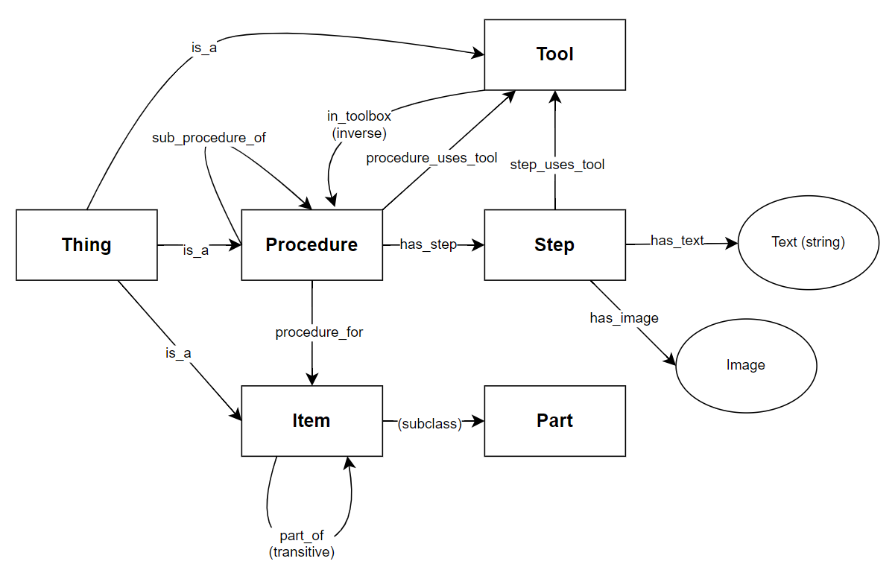

# User Manual  
*Authors: Lewei Xu (23709058), Marc Labouchardiere (23857377)*  

In this project, we use a small subset of data from the iFixit dataset of procedures to demonstrate searching, adding, updating, and deleting procedures using ontologies and knowledge graphs.

## Overview of Schema and Ontology Rules  

The schema of our ontology defines the following core classes, representing the key objects in the iFixit dataset:  

- **Procedure:** `Thing`
- **Item:** `Thing`
- **Part:** _(subclass of)_ `Item`
- **Tool:** `Thing`
- **Step:** `Thing`
- **Image:** `Thing`

These are the foundational building blocks of our knowledge base, where all relevant objects can be expressed as one of these classes. Next, we define the relationships between these classes and set constraints for these relationships.

### Key Relationships and Constraints  
- **`step_uses_tool`**: `(Step -> Tool)`  
    - **Minimum relations**: 0 (A step may not necessarily use a tool)  
    - **Maximum relations**: Theoretically, too many tools in one step would indicate a need to split it into smaller steps, but we do not enforce this here.  
    - **Constraint**: Every tool used in a step must belong to the procedure's toolbox.  
      
- **`has_step`**: `(Procedure -> Step)`  
    - **Minimum relations**: 1 (A procedure must have at least one step)  
    - **Maximum relations**: Although having too many steps could indicate poor procedure design, we do not enforce any upper limit.  

- **`has_image`**: `(Step -> Image)`  
    - **Minimum relations**: 0 (Steps may not necessarily include an image)  

- **`sub_procedure_of`**: `(Procedure -> Procedure)`  
    - This occurs when two procedures are for the same item or part of an item.

- **`procedure_for`**: `(Procedure -> Item)`  
    - **Minimum relations**: 1 (Every procedure must be for at least one item; otherwise, it's invalid).  

- **`part_of`**: `(Item -> Item)`  
    - **Minimum relations**: 1 (An item must be a part of at least one other item).  
    - **Constraint**: This property is **transitive**. If Item 1 is part of Item 2, and Item 2 is part of Item 3, then Item 1 is also part of Item 3.  

- **`in_toolbox`**: `(Tool -> Procedure)`  
    - **Minimum relations**: 1 (A tool must be included in at least one procedure's toolbox, or it's considered redundant).  

- **`procedure_uses_tool`**: `(Procedure -> Tool)` _(inverse of `in_toolbox`)_  
    - **Minimum relations**: 0 (A procedure may not need any tools).

### Data Attributes for Classes  
In addition to relationships, specific objects have data attributes that store relevant information:

- **`has_name`**: `(Thing -> str)`  
    - Every **procedure**, **item**, **part**, and **tool** has a `name` attribute, represented as a string.  

- **`has_text`**: `(Step -> str)`  
    - Each **step** has a text description of its contents.

### URI Structure for Unique Instances  

To ensure consistency across our knowledge graph, each class instance must use a unique URI. The following rules apply:

- **Procedure**: Use the procedure's URL as its unique URI.
- **Item**: Use the item’s name (which is consistent in the dataset) as its unique identifier.
- **Part**: Follow the same method as for items.
- **Tool**: Use the URL of the tool if available. If a tool lacks a URL, default to its name.
- **Step**: Use the unique step ID associated with each step. This allows multiple procedures to share steps without duplicates.
- **Image**: Use the image's URL as its unique URI.

### Overview of Ontology

Diagram: *Ontology Schema*

## How to Form Queries and Examples  
This section provides guidelines for forming SPARQL queries to retrieve information from the knowledge graph.

### Forming Queries With the Defined Schema
We have defined our knowledge graph schema in such a way that each class has a unique identifier usually using the URL, and then using the **`ObjectProperty`** **`has_name`** to allow for human readable plaintext. As such, when forming queries, it is generally best to use **`ex:has_name`** to output readable text if the output if for the classes Procedure, Item (Part) and Tool. 

From the diagram of the ontology above, we can see the available paths that we take for building more complicated SPARQL queries.

### General Approach to Forming Queries

- **Identify Necessary Classes and Properties**:  
    Start by identifying the main class you want to query, as well as the properties/paths necessary to get the class. For instance, if you are trying to get all steps in a procedure, the main class we are interest in is `Step`, and the related class is `Procedure` which is linked to `Step` via the `has_step` property.

- **Use Data Properties**:  
    You will also need to utilize the data properties `has_text` or `has_name` to output human readable text when running SPARQL queries. 

- **Use Filters**:  
    The `FILTER` clause can be used to refine and filter results. Use it to set conditions that must be met for an instance to be included in the results. This can be used to specify which instances appear in the results. Alternatively, use the `NOT` clause before `FILTER` to do a reverse filter.

- **Aggregation Functions**:  
    For queries requiring summary statistics (e.g., counting steps in a procedure), you can use aggregatioin functions such as `COUNT` or `SUM`. Pair these with the `GROUP BY` clause to to find summary statistics of groups of instances.

- **Path Traversals**:  
    With the way the ontology is set up, we can utilize the various paths around the knowledg graph to construct more complex queries involving multiple classes and properties. Familiarize yourself with the ontology diagram above to help with this process.

### Example 1: Retrieving All Steps For a Procedure
```sparql
PREFIX ex: <http://test.org/ifixit.com#>  
SELECT ?step_text  
WHERE {  
    ?procedure a ex:Procedure ;  
        ex:has_step ?step .  
    ?step ex:has_text ?step_text  
    FILTER (?procedure = <procedure_uri>)  
}
```
We use the procedure's URL as the URI, so if the URL for a procedure is known, we can get all the steps of a procedure. In this specific example, we are outputting the raw text describing each step. Alternatively, we can remove the FILTER to output the steps for every procedure.

### Example 2: Retrieving All Tools Used by a Procedure
```sparql
PREFIX ex: <http://test.org/ifixit.com#>
SELECT ?tool
WHERE {
    ?procedure a ex:Procedure .
    ?procedure ex:procedure_uses_tool ?tool .
    ?tool ex:has_name ?tool_name .
    FILTER (?procedure = <procedure_uri>)
}
```
Similarly, we can get all the tools a specific procedure uses.

### Example 3: Finding Complicated Procedures
```sparql
PREFIX ex: <http://test.org/ifixit.com#><br>
SELECT ?procedure_name (COUNT(DISTINCT ?step) AS ?step_count) (COUNT(DISTINCT ?tool) AS ?tool_count)<br>
WHERE {<br>
    ?procedure a ex:Procedure ;<br>
    ex:has_step ?step ;<br>
    ex:has_name ?procedure_name ;<br>
    ex:procedure_uses_tool ?tool .<br>
}
GROUP BY ?procedure
HAVING (COUNT(DISTINCT ?step) > 20) && (COUNT(DISTINCT ?tool) > 5)
```
The previous two examples are fairly simple. We can also do more complicated aggregate/path finding queries on the knowledge graph. The example query above finds "complicated" queries that have more than 20 steps and use more than 5 tools.

## Adding, Updating and Removing Data